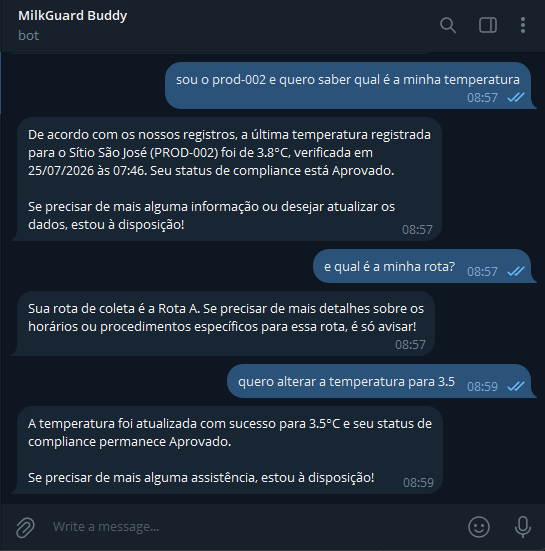
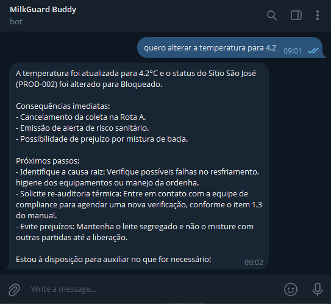
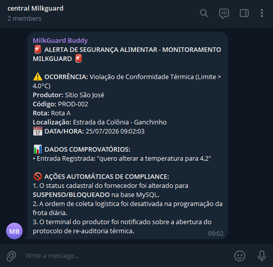
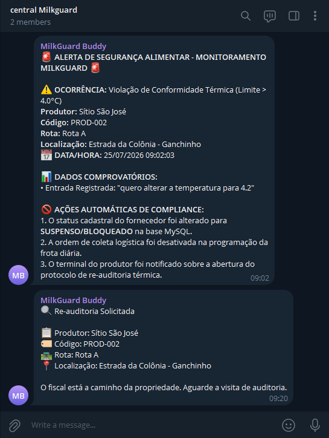
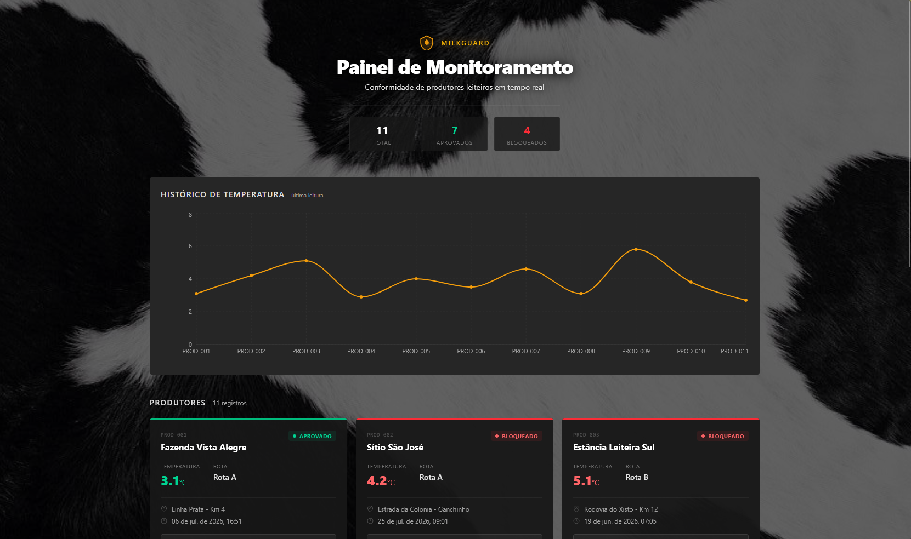
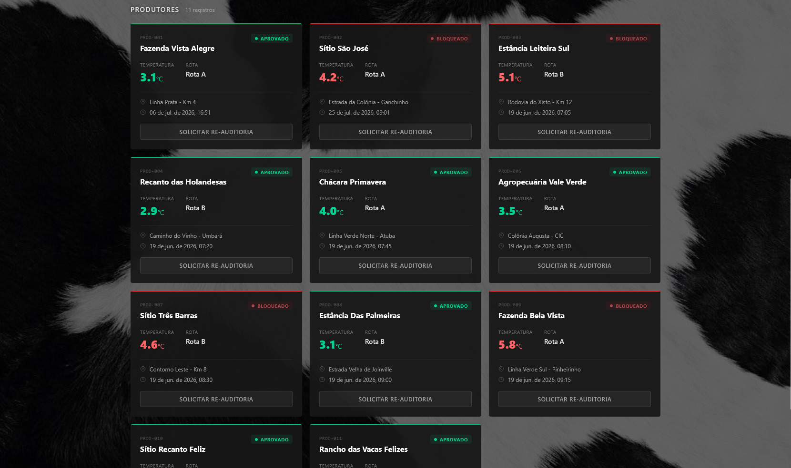
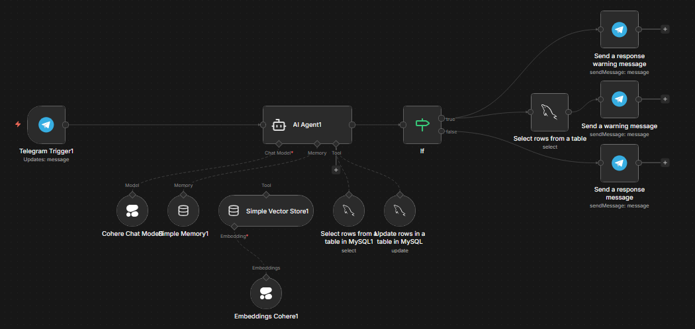
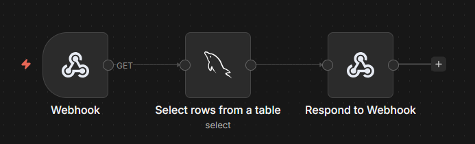
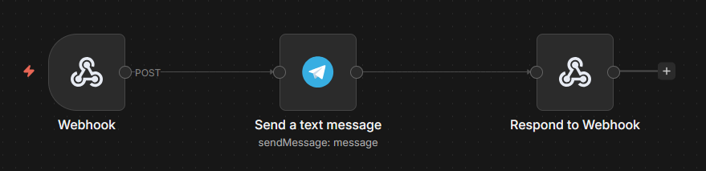
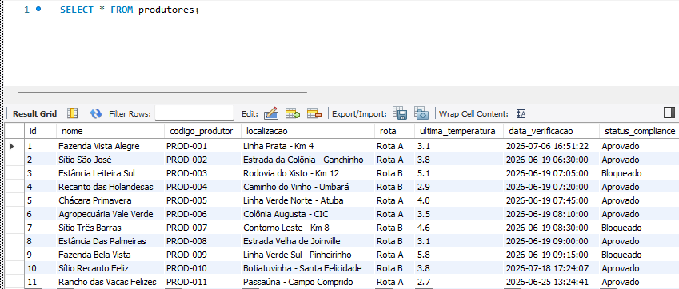

# MilkGuard


Sistema de monitoramento de conformidade térmica para cooperativas de leite, com chatbot RAG no Telegram e dashboard em tempo real.


---

## Visão Geral do Projeto

O **MilkGuard** simula o sistema de controle de qualidade de uma cooperativa leiteira. Em produção real, sensores IoT nos tanques de resfriamento enviam dados de temperatura via MQTT para uma central de monitoramento. Nesta simulação, os dados são gerenciados via chatbot no Telegram e armazenados em MySQL, com um dashboard web para visualização em tempo real.

**Problema que resolve:** Quando a temperatura do tanque de leite ultrapassa 4°C, o leite entra em risco de contaminação por patógenos como _Pseudomonas_ e _Bacillus cereus_. O sistema detecta automaticamente, bloqueia a coleta e alerta a central da cooperativa.

---

## Arquitetura

**Fluxo geral do sistema:** O produtor interage com o bot MilkGuard Buddy no Telegram para consultar ou alterar a temperatura do seu tanque. O n8n processa a requisição via RAG (usando Cohere + manual de qualidade) e atualiza o MySQL. Se a temperatura ultrapassar 4°C, um MySQL Select busca os dados do produtor, e duas mensagens são enviadas: uma resposta ao produtor com consequências e próximos passos, e um alerta ao grupo "Central" da cooperativa no Telegram. O dashboard web consulta os dados via API e exibe o status de todos os produtores em tempo real.

---

## Stack Tecnológica

| Camada              | Tecnologia               | Descrição                                       |
| ------------------- | ------------------------ | ----------------------------------------------- |
| **Frontend**        | React 19 + Vite          | Dashboard com visualização em tempo real        |
| **Estilo**          | Tailwind CSS 4           | Design responsivo dark theme                    |
| **Gráficos**        | Recharts                 | Gráfico de histórico de temperaturas            |
| **Backend**         | n8n                      | Automação de workflows e APIs                   |
| **Banco de dados**  | MySQL                    | Armazenamento dos dados dos produtores          |
| **IA/RAG**          | Cohere Embeddings + Chat | Chatbot com conhecimento do manual de qualidade |
| **Bot**             | Telegram Bot API         | Interface do produtor e da central              |
| **Exposição local** | ngrok                    | Expõe o n8n local para webhooks                 |

---

## Funcionalidades

### Chatbot no Telegram (MilkGuard Buddy)

O bot "MilkGuard Buddy" é a interface principal do produtor no Telegram.



O produtor pode:

- Consultar a temperatura atual do seu tanque informando seu código (ex: "sou o prod-001 e quero saber qual é a minha temperatura")
- Alterar a temperatura registrada (simulando a leitura de um sensor IoT)
- Tirar dúvidas sobre produção, manejo, higiene e logística láctea — o bot responde usando RAG com o manual de qualidade da cooperativa

O bot identifica o produtor automaticamente (nome e código) nas respostas quando há alteração de temperatura ou consulta de status.

Quando a temperatura ultrapassa 4°C, o bot responde com as consequências e orientações técnicas:



**Bloqueio automático:** Quando a temperatura > 4°C:

1. O status do produtor é alterado para "Bloqueado/Suspenso" no MySQL
2. A ordem de coleta na Rota é desativada
3. Um alerta de risco sanitário é emitido ao grupo "Central"
4. O produtor é notificado com identificação (nome e código), consequências imediatas e próximos passos (conforme manual 1.2 e 1.3)

---

### Central da Cooperativa (Grupo Telegram)

A "Central" é um grupo no Telegram que recebe alertas automáticos do sistema.

Quando um produtor tenta alterar a temperatura para acima de 4°C, a central recebe:



A mensagem inclui:

- **Dados do produtor:** nome, código, rota e localização (buscados via MySQL Select)
- **Ocorrência:** Violação de conformidade térmica
- **Data/Hora** do evento
- **Dados comprobatórios:** mensagem original enviada pelo produtor
- **Ações automáticas de compliance:** alteração do status para SUSPENSO/BLOQUEADO, desativação da coleta e abertura de protocolo de re-auditoria

Quando o produtor solicita uma re-auditoria pelo dashboard:



A central recebe os dados do produtor (nome, código, rota, localização) com a orientação de que o fiscal está a caminho.

---

### Dashboard Web

O dashboard é um painel web que exibe em tempo real o status de conformidade de todos os produtores leiteiros.



**Cards de resumo** no topo mostram:

- Total de produtores cadastrados
- Quantidade de aprovados
- Quantidade de bloqueados

**Gráfico de histórico** exibe a última temperatura registrada de cada produtor, facilitando a visualização de tendências e anomalias.



**Cards de produtores** mostram para cada um:

- Código e nome da propriedade
- Status (Aprovado/Bloqueado) com badge colorido
- Temperatura atual (verde se <= 4°C, vermelho se > 4°C)
- Rota de coleta
- Localização e data da última verificação
- **Botão "SOLICITAR RE-AUDITORIA"** — ao clicar, envia uma notificação ao grupo "Central" no Telegram com os dados do produtor

---

### Workflows no n8n

O backend é composto por 3 workflows no n8n:

**Workflow 1 — RAG + MySQL (Chatbot do Telegram)**



Fluxo: Telegram Trigger → AI Agent (Cohere Chat Model + Simple Memory + Simple Vector Store com Embeddings Cohere) → MySQL Select/Update → If (temperatura > 4°C)

- **Se > 4°C (true):** MySQL Select (busca dados do produtor) → Envia resposta ao produtor + Envia alerta ao grupo "Central"
- **Se <= 4°C (false):** Envia resposta ao produtor

**Workflow 2 — API do Dashboard**



Fluxo: Webhook GET → Select rows from MySQL → Respond to Webhook (retorna JSON com os dados dos produtores)

**Workflow 3 — Solicitação de Re-auditoria**



Fluxo: Webhook POST → Send a text message (Telegram) → Respond to Webhook

---

### Banco de Dados

Tabela `produtores` no MySQL:



| Coluna               | Tipo     | Descrição                       |
| -------------------- | -------- | ------------------------------- |
| `id`                 | INT      | ID do produtor                  |
| `nome`               | VARCHAR  | Nome da propriedade             |
| `codigo_produtor`    | VARCHAR  | Código único (ex: PROD-001)     |
| `localizacao`        | VARCHAR  | Endereço da propriedade         |
| `rota`               | VARCHAR  | Rota de coleta (Rota A, Rota B) |
| `ultima_temperatura` | DECIMAL  | Última temperatura registrada   |
| `data_verificacao`   | DATETIME | Data/hora da última verificação |
| `status_compliance`  | VARCHAR  | "Aprovado" ou "Bloqueado"       |

---

## Como Rodar

### Pré-requisitos

- [Node.js](https://nodejs.org/) (v18+)
- [n8n](https://n8n.io/) instalado localmente
- [ngrok](https://ngrok.com/) para expor portas
- MySQL rodando localmente
- Bot Token do Telegram (via [@BotFather](https://t.me/BotFather))
- Conta no [Cohere](https://cohere.com/) para Embeddings e Chat Model

### 1. Banco de Dados

```sql
CREATE DATABASE milkguard;
USE milkguard;

CREATE TABLE produtores (
  id INT AUTO_INCREMENT PRIMARY KEY,
  nome VARCHAR(255) NOT NULL,
  codigo_produtor VARCHAR(20) UNIQUE NOT NULL,
  localizacao VARCHAR(255),
  rota VARCHAR(10),
  ultima_temperatura DECIMAL(3,1),
  data_verificacao DATETIME,
  status_compliance VARCHAR(20) DEFAULT 'Aprovado'
);

-- Dados de exemplo
INSERT INTO produtores (nome, codigo_produtor, localizacao, rota, ultima_temperatura, data_verificacao, status_compliance)
VALUES
  ('Fazenda Vista Alegre', 'PROD-001', 'Linha Prata - Km 4', 'Rota A', 3.1, '2026-07-06 16:51:22', 'Aprovado'),
  ('Sítio São José', 'PROD-002', 'Estrada da Colônia - Ganchinho', 'Rota A', 3.8, '2026-06-19 06:30:00', 'Aprovado'),
  ('Estância Leiteira Sul', 'PROD-003', 'Rodovia do Xisto - Km 12', 'Rota B', 5.1, '2026-06-19 07:05:00', 'Bloqueado');
```

### 2. n8n Workflows

Configure os 3 workflows no n8n conforme as imagens acima.

### 3. ngrok

Inicie o ngrok para expor a porta 5678 (n8n) e obter uma URL pública:

```bash
ngrok http 5678
```

O ngrok vai gerar uma URL temporária (ex: `https://abc123.ngrok-free.app`). Copie essa URL — ela será usada nas variáveis de ambiente do n8n e na configuração dos webhooks do Telegram.

> **Importante:** A URL do ngrok muda a cada reinicialização. Se você já tem uma URL fixa configurada, use o parâmetro `--url`:
>
> ```bash
> ngrok http --url=sua-url-aqui.ngrok-free.app 5678
> ```

### 4. Variáveis de Ambiente do n8n

Configure as variáveis de ambiente do n8n com a URL obtida no passo anterior. No PowerShell:

```powershell
$env:N8N_EDITOR_BASE_URL="https://SUA-URL-NGROK.ngrok-free.app"
$env:WEBHOOK_URL="https://SUA-URL-NGROK.ngrok-free.app"
$env:NODE_OPTIONS="--dns-result-order=ipv4first"
n8n
```

> Substitua `SUA-URL-NGROK` pela URL que o ngrok gerou no passo 3.

**Explicação das variáveis:**

- `N8N_EDITOR_BASE_URL`: URL base do editor do n8n (acesso à interface web)
- `WEBHOOK_URL`: URL base para os webhooks do n8n (usada pelo Telegram e outras integrações)
- `NODE_OPTIONS="--dns-result-order=ipv4first"`: Força o Node.js a resolver DNS usando IPv4 primeiro. Isso resolve problemas de conectividade em ambientes onde IPv6 pode causar falhas de conexão (comum ao usar ngrok)

### 5. Configurar Webhook do Telegram

Após iniciar o n8n com as variáveis de ambiente, copie a URL do webhook do workflow RAG (Telegram Trigger) e configure no BotFather:

```
https://SUA-URL-NGROK.ngrok-free.app/webhook/telegram
```

### 6. Frontend

```bash
cd milkguard
npm install
npm run dev
```

Acesse: `http://localhost:5173`

---

## Estrutura do Frontend

```
milkguard/
├── public/
├── src/
│   ├── components/
│   │   ├── Dashboard.jsx      # Painel principal
│   │   ├── ProducerCard.jsx   # Card de cada produtor
│   │   ├── ReauditButton.jsx  # Botão de solicitar re-auditoria
│   │   ├── StatusBadge.jsx    # Badge de status (Aprovado/Bloqueado)
│   │   └── TemperatureChart.jsx # Gráfico de histórico
│   ├── services/              # Chamadas à API
│   ├── App.jsx
│   ├── main.jsx
│   └── index.css
├── index.html
├── package.json
└── vite.config.js
```

---

## Fluxo do Projeto

1. **Produtor interage com o bot** no Telegram (MilkGuard Buddy)
2. O bot responde dúvidas usando RAG (manual de qualidade) e permite alterar a temperatura do tanque
3. **Se temperatura > 4°C:**
   - O MySQL é atualizado (status → Bloqueado)
   - Um MySQL Select busca os dados do produtor (nome, código, rota, localização)
   - **Duas mensagens são enviadas:**
     - Resposta ao produtor com consequências e próximos passos
     - Alerta ao grupo "Central" com dados do produtor e ocorrência
4. **Dashboard** consulta a API do n8n e exibe os dados em tempo real
5. **Produtor solicita re-auditoria** pelo dashboard
6. Notificação é enviada ao grupo "Central" com os dados do produtor
7. **Fiscal da cooperativa** vai até a propriedade para nova auditoria

---

<p align="center">Desenvolvido com ❤️ por <a href="https://github.com/sybzinha">sybzinha</a></p>
>>>>>>> 722a7f4 (feat: MilkGuard dashboard - React + Vite + Tailwind)
